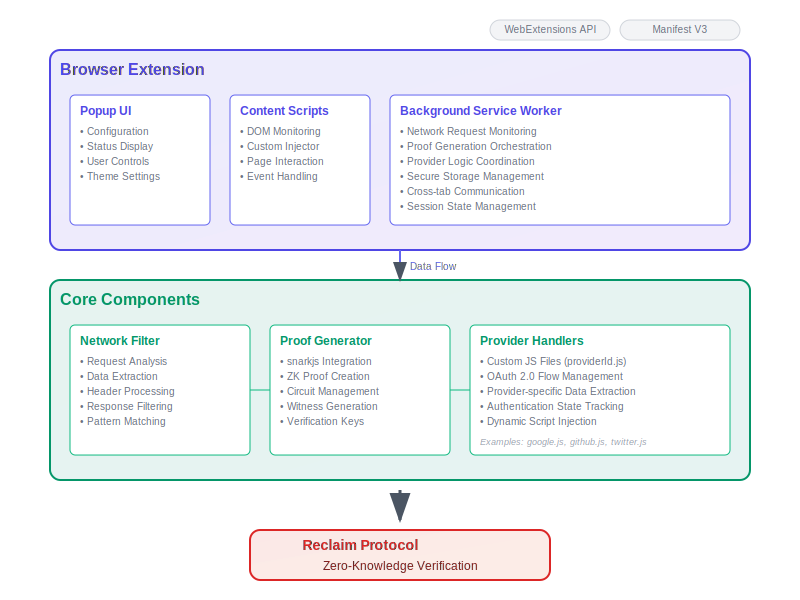

# Reclaim Browser Extension Template

A comprehensive browser extension template built for the Reclaim Protocol ecosystem. This template provides a solid foundation for developers to create custom browser extensions that generate zero-knowledge proofs from web activity, enabling privacy-preserving credential verification.

## 🎯 Purpose

This project serves as a **template and SDK** for developers who want to build browser extensions that integrate with the Reclaim Protocol. Rather than starting from scratch, you can fork this template, customize it for your specific use case, and add additional features on top of the robust foundation we've provided.

## 🏗️ Architecture Overview



The extension follows a modular architecture with three main layers:

**Browser Extension Layer:**
- **Popup UI**: Configuration interface, status display, and user controls
- **Content Scripts**: DOM monitoring, custom script injection, and page interaction  
- **Background Service Worker**: Network monitoring, proof orchestration, and state management

**Core Components Layer:**
- **Network Filter**: Analyzes requests, extracts data, and processes responses
- **Proof Generator**: Integrates with snarkjs and Noir circuits for zero-knowledge proof creation
- **Noir Circuit Adapter**: Provides seamless integration with Noir zero-knowledge circuits
- **Provider Handlers**: Custom JavaScript files (providerId.js) for provider-specific logic

**Integration:**
- All components work together to generate cryptographic proofs that are verified by the Reclaim Protocol without exposing the underlying user data.

## 🚀 Quick Start

### Prerequisites
- Node.js 16+ 
- npm or yarn
- Modern browser (Chrome/Firefox/Edge)

### Installation & Setup

1. **Clone the template**:
   ```bash
   git clone https://github.com/your-org/reclaim-extension-template.git
   cd reclaim-extension-template
   ```

2. **Install dependencies**:
   ```bash
   npm install
   ```

3. **Download and setup Noir circuits**:
   ```bash
   node download-circuits.js
   ```

4. **Development mode** (with hot reload):
   ```bash
   npm run dev
   ```

5. **Production build**:
   ```bash
   npm run build
   ```

6. **Load in browser**:
   - **Chrome**: Navigate to `chrome://extensions/` → Enable Developer Mode → Load Unpacked → Select `build/` folder
   - **Firefox**: Navigate to `about:debugging` → This Firefox → Load Temporary Add-on → Select any file in `build/`

## 🔄 Provider Setup

The extension includes an automated provider setup system that fetches the latest provider configurations and JavaScript injection scripts from the Reclaim Protocol API.

### Available Scripts

```bash
# Fetch latest providers and generate injection scripts
npm run setup:providers

# Build extension for development
npm run dev

# Build extension for production  
npm run build
```

### Provider Setup Details

The `setup:providers` command:

- **Fetches Active Providers**: Connects to `https://api.reclaimprotocol.org/api/providers/active`
- **Processes 20,000+ Providers**: Automatically handles the complete provider registry
- **Generates Injection Scripts**: Creates JavaScript files in `src/js-scripts/` for providers with custom injections
- **Smart Updates**: Only updates files when content changes, skips unnecessary writes
- **Detailed Logging**: Shows created, updated, and unchanged file counts

### Usage Workflow

**For Development:**
```bash
# Update providers when needed
npm run setup:providers

# Start development
npm run dev
```

**For Production:**
```bash
# Ensure latest providers  
npm run setup:providers

# Build for production
npm run build
```

### Generated Files

Provider injection scripts are automatically generated in:
```
src/js-scripts/
├── [provider-id-1].js    # Custom injection for provider 1
├── [provider-id-2].js    # Custom injection for provider 2
└── ...                   # One file per provider with custom injection
```

These files are automatically loaded by the extension when users interact with their respective provider websites.

## 📁 Project Structure

```
src/
├── assets/                # Icons, images, static files
│   └── img/               # Logo and other images
├── background/            # Background service worker and related logic
│   ├── background.js
│   ├── messageRouter.js
│   ├── sessionManager.js
│   ├── proofQueue.js
│   ├── tabManager.js
│   ├── cookieUtils.js
│   ├── types.js
│   └── README.md
├── content/               # Content scripts for web pages
│   ├── content.js
│   └── components/
│       └── ProviderVerificationPopup.js
├── interceptor/           # Network interception logic
│   └── network-interceptor.js
├── js-scripts/            # Custom JS scripts for injection
│   ├── sample.js
│   └── 8f8f3def-7864-4dae-890d-9e95c5e45bec.js
├── offscreen/             # Offscreen document and scripts
│   ├── offscreen.html
│   └── offscreen.js
├── utils/                 # Utility functions and helpers
│   ├── polyfills.js
│   ├── offscreen-manager.js
│   ├── session-timer.js
│   ├── fetch-calls.js
│   ├── websocket-polyfill.js
│   ├── polyfill-test.js
│   ├── offscreen-websocket.js
│   ├── logger/
│   │   ├── index.js
│   │   ├── debugLogger.js
│   │   ├── LogEntry.js
│   │   ├── LoggerService.js
│   │   ├── constants.js
│   │   └── README.md
│   ├── proof-generator/
│   │   ├── proof-generator.js
│   │   ├── proof-formatter.js
│   │   └── index.js
│   ├── constants/
│   │   ├── constants.js
│   │   ├── interfaces.js
│   │   └── index.js
│   ├── claim-creator/
│   │   ├── claim-creator.js
│   │   ├── claim-creator.test.js
│   │   ├── index.js
│   │   ├── network-filter.js
│   │   ├── params-extractor.js
│   │   ├── params-extractor-utils.js
│   │   └── replay-request.js
│   └── mocks/
│       ├── jsdom-mock.js
│       ├── koffi-mock.js
│       ├── re2-mock.js
│       └── worker-threads-mock.js
└── manifest.json          # Extension manifest
```

## 🎨 UI Customization & Styling

The extension UI is fully customizable to match your brand and requirements.

### Popup Interface Customization

**Location**: `src/popup/`

```css
/* src/popup/styles.css - Customize the popup appearance */
:root {
  --primary-color: #your-brand-color;
  --secondary-color: #your-secondary-color;
  --background: #your-background;
  --text-color: #your-text-color;
}

.popup-container {
  /* Modify dimensions, colors, layout */
  width: 400px;
  min-height: 500px;
}
```

**Key Customization Points**:
- **Colors & Branding**: Update CSS variables in `styles.css`
- **Layout**: Modify `index.html` structure
- **Interactions**: Extend `popup.js` for custom functionality
- **Animations**: Add CSS transitions and animations
- **Dark/Light Modes**: Implement theme switching

### Content Script Styling

**Location**: `src/content/`

Customize how the extension interacts with web pages:

```javascript
// src/content/index.js - Customize injected UI elements
const createOverlay = () => {
  const overlay = document.createElement('div');
  overlay.className = 'reclaim-overlay'; // Style this in your CSS
  // Add your custom styling and functionality
};
```

## 🔧 Core Components Deep Dive

### 1. Network Filter (`src/background/networkFilter.js`)

Monitors and filters network requests to extract verification data:

```javascript
class NetworkFilter {
  constructor() {
    this.activeFilters = new Map();
  }
  
  // Add custom filtering logic for your providers
  addProviderFilter(providerId, filterConfig) {
    // Implement your custom network filtering
  }
}
```

### 2. Proof Generator (`src/utils/proofGenerator.js`)

Handles zero-knowledge proof creation using snarkjs and Noir circuits:

```javascript
class ProofGenerator {
  async generateProof(data, providerConfig) {
    // Customize proof generation logic
    // Add support for different proof systems
  }
}
```

### 3. Noir Circuit Adapter (`src/utils/noir-adapter.js`)

Provides seamless integration with Noir zero-knowledge circuits:

```javascript
import { noirAdapter } from './utils/noir-adapter';

// Initialize a Noir circuit
await noirAdapter.initializeCircuit('aes-gcm', circuitBytecode);

// Generate proof using Noir
const proof = await noirAdapter.generateProof('aes-gcm', {
  encryptedData: new Uint8Array([...]),
  key: new Uint8Array([...]),
  iv: new Uint8Array([...]),
  tag: new Uint8Array([...]),
  expectedPlaintextHash: new Uint8Array([...])
});

// Verify proof
const isValid = await noirAdapter.verifyProof('aes-gcm', proof.proof);
```

## 🔐 Noir Circuit Integration

The extension now supports Noir zero-knowledge circuits for enhanced cryptographic proof generation. This integration provides:

- **AES-GCM Decryption Verification**: Prove knowledge of encrypted data without revealing the plaintext
- **Modular Circuit Architecture**: Easy integration of new Noir circuits
- **Seamless API**: Unified interface for both snarkjs and Noir proof systems

### Circuit Files

Noir circuits are located in `src/circuits/noir/` and include:
- `aes_128_ctr.json`: Circuit bytecode for AES-128-CTR decryption verification
- `aes_256_ctr.json`: Circuit bytecode for AES-256-CTR decryption verification
- `chacha20.json`: Circuit bytecode for ChaCha20 decryption verification
- Additional circuits can be added following the same pattern

### Chrome Extension Integration

The Noir circuits integrate seamlessly with the Chrome extension architecture:

1. **Offscreen Document**: Noir proof generation runs in an offscreen document (`src/offscreen/offscreen.js`) to avoid blocking the main thread
2. **Message Passing**: The extension uses Chrome's message passing API to communicate between content scripts, background scripts, and the offscreen document
3. **Proof Generation Flow**:
   ```
   Content Script → Background Script → Offscreen Document → Noir Circuit → Proof
   ```

### Usage in Chrome Extension Context

```javascript
// In background script or content script
chrome.runtime.sendMessage({
  type: 'GENERATE_NOIR_PROOF',
  circuitName: 'aes_128_ctr',
  inputs: {
    encryptedData: new Uint8Array([...]),
    key: new Uint8Array([...]),
    iv: new Uint8Array([...]),
    expectedPlaintextHash: new Uint8Array([...])
  }
}, (response) => {
  if (response.success) {
    console.log('Proof generated:', response.proof);
  } else {
    console.error('Proof generation failed:', response.error);
  }
});
```

### 3. Provider System (`src/providers/`)

Extensible provider system for different web services.

## 🔌 Custom Provider Implementation

### Creating Custom Providers with DevTool

The easiest way to add new providers is using our **[Developer Tool](https://dev.reclaimprotocol.org)** 🛠️

**Step-by-step process:**

1. **Create Your Provider**
   - Visit the [Dev Tool](https://dev.reclaimprotocol.org)
   - Design a custom provider for any website or service you want to verify
   - Configure the data extraction rules and verification parameters

2. **Set Up Your Application**
   - Create a new application in the Dev Tool
   - This generates the necessary configuration for your extension

3. **Integrate with Your Extension**
   - Use our [JavaScript SDK](https://github.com/reclaimprotocol/reclaim-js-sdk) to connect your application
   - The SDK will automatically trigger this browser extension when users need verification

**What this achieves:** Your users can seamlessly verify credentials from any web service while keeping their data private through zero-knowledge proofs.

### Custom JavaScript Injections

For providers requiring custom JavaScript execution on their pages:

1. **File Naming Convention**: `src/providers/[providerId].js`
2. **Automatic Loading**: The extension automatically loads and injects scripts based on provider ID
3. **Scope**: Injected scripts have access to the provider's page DOM and can interact with their APIs

**Example injection workflow**:
```javascript
// The extension automatically looks for and loads:
// src/providers/linkedin.js   → for LinkedIn data
// src/providers/[your-provider].js → for your custom provider
```

## 🛠️ Development Workflow

### Adding New Features

1. **Identify Extension Point**: Determine where your feature fits (background, content, popup, or provider)
2. **Extend Base Classes**: Inherit from existing components where possible
3. **Add Provider Logic**: Create custom provider files if needed
4. **Update Manifest**: Add any new permissions or resources
5. **Test Thoroughly**: Test across different browsers and scenarios

### Testing Your Extension

```bash
# Run development server
npm run dev

# Run tests (add your test framework)
npm test

# Build for production
npm run build

# Package for distribution
npm run package
```

## 🧪 Testing

Run the test suite:

```bash
npm test
```

For coverage reports:

```bash
npm run test:coverage
```

### Testing Noir Circuits

The test suite includes comprehensive tests for Noir circuit integration:

- **Unit Tests**: Test individual circuit operations and adapter functions
- **Integration Tests**: Verify end-to-end proof generation and verification
- **Mock Environment**: Simulate Chrome extension environment for testing

```bash
# Run specific Noir adapter tests
npm test -- noir-adapter.test.js
```

### Browser-Specific Considerations

The template includes polyfills for Node.js modules to ensure compatibility:

- **Webpack Configuration**: `webpack.config.js` handles module resolution
- **Polyfills**: `src/utils/polyfills.js` provides browser compatibility
- **Manifest V3**: Built for modern extension standards

## 📦 Distribution & Deployment

### Extension Store Preparation

1. Update `manifest.json` with your extension details
2. Prepare store assets (icons, screenshots, descriptions)
3. Test thoroughly across target browsers
4. Submit to respective extension stores

## 📚 API Reference

### Core Classes

#### `ProofGenerator`

Handles zero-knowledge proof generation:

```javascript
const generator = new ProofGenerator();
const proof = await generator.generateProof(data, config);
```

#### `NoirAdapter`

Provides Noir circuit integration:

```javascript
import { noirAdapter } from './utils/noir-adapter';

// Initialize circuit
await noirAdapter.initializeCircuit('aes_128_ctr', circuitBytecode);

// Generate proof
const proof = await noirAdapter.generateProof('aes_128_ctr', inputs);

// Verify proof
const isValid = await noirAdapter.verifyProof('aes_128_ctr', proof.proof);

// Get circuit info
const info = noirAdapter.getCircuitInfo('aes_128_ctr');
```

### Message API for Chrome Extension

#### Noir Proof Generation

```javascript
// Send message to generate Noir proof
chrome.runtime.sendMessage({
  type: 'GENERATE_NOIR_PROOF',
  circuitName: 'aes_128_ctr',
  inputs: {
    encryptedData: Uint8Array,
    key: Uint8Array,
    iv: Uint8Array,
    expectedPlaintextHash: Uint8Array
  }
});

// Response format
{
  success: boolean,
  proof?: {
    proof: Uint8Array,
    publicInputs: Uint8Array[]
  },
  error?: string
}
```

## 🔒 Security & Privacy

- **Zero-Knowledge Proofs**: Data verification without exposure
- **Local Processing**: Sensitive operations happen locally
- **Minimal Permissions**: Only essential browser permissions requested
- **Secure Storage**: Encrypted local storage for sensitive data

### Best Practices

#### Security Guidelines

1. **Data Handling**:
   - Never store sensitive data in plain text
   - Use secure random number generation for cryptographic operations
   - Implement proper input validation and sanitization

2. **Network Security**:
   - Validate all network requests and responses
   - Use HTTPS for all external communications
   - Implement request rate limiting to prevent abuse

3. **Extension Security**:
   - Follow principle of least privilege for permissions
   - Sanitize all DOM interactions in content scripts
   - Use Content Security Policy (CSP) headers

#### Performance Optimization

1. **Proof Generation**:
   - Use Web Workers for heavy cryptographic operations
   - Implement proof caching for repeated operations
   - Optimize circuit parameters for faster execution

2. **Memory Management**:
   - Clean up unused circuit instances
   - Implement proper garbage collection for large data structures
   - Monitor memory usage in background scripts

3. **Network Optimization**:
   - Batch network requests when possible
   - Implement request deduplication
   - Use efficient data serialization formats

## 🤝 Contributing to the Template

We welcome contributions that improve the template for all developers:

1. Fork the repository
2. Create a feature branch
3. Add comprehensive tests
4. Update documentation
5. Submit a pull request

### Development Guidelines

#### Code Style

- Follow ESLint configuration provided in the template
- Use TypeScript for type safety where applicable
- Write comprehensive JSDoc comments for all public APIs
- Follow consistent naming conventions across the codebase

#### Testing Requirements

- Write unit tests for all new functionality
- Include integration tests for complex workflows
- Test across multiple browser environments
- Maintain minimum 80% code coverage

#### Documentation Standards

- Update README.md for any new features
- Include inline code documentation
- Provide usage examples for new APIs
- Update architecture diagrams when needed

## 📚 Resources & Documentation

- [Reclaim Protocol Documentation](https://docs.reclaimprotocol.org)
- [Browser Extension APIs](https://developer.mozilla.org/en-US/docs/Mozilla/Add-ons/WebExtensions)
- [snarkjs Documentation](https://github.com/iden3/snarkjs)

## 🆘 Support & Community

- **Issues**: [GitHub Issues](https://github.com/your-org/reclaim-extension-template/issues)
- **Discussions**: [GitHub Discussions](https://github.com/your-org/reclaim-extension-template/discussions)  
- **Documentation**: [Full Documentation Site](https://docs.reclaimprotocol.org/extensions)

## 📄 License

MIT License - see [LICENSE](LICENSE) file for details.

---

**🚀 Ready to build your privacy-preserving browser extension? Start by forking this template and customizing it for your use case!**